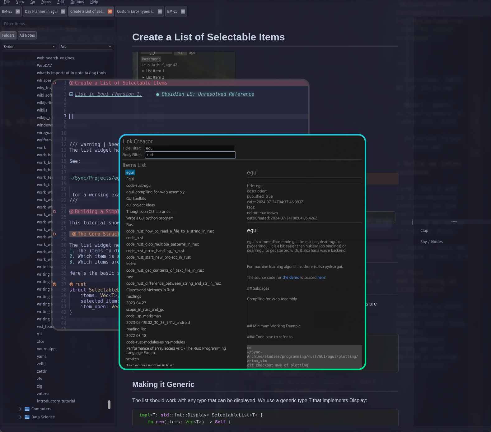

# Note Link Creator

A fast and efficient link selector for Chalsedony (and Joplin). This is primarily for inserting links into other editors such as vim and emacs



## Features

- 🖥️ Simple, minimal GUI
- 🔍 Full-text search across notes, unlike fzf which is just title
- 🎯 Title-specific fuzzy search using BM25 trigram algorithm
- ⌨️ Keyboard-first interface
- 📝 CLI support for automation and scripting

## Installation

```bash
cd $(mktemp -d)
git clone https://github.com/RyanGreenup/egui_joplin_fzf
cd egui_joplin_fzf
cargo install --path .
chalsedony_selector
```

## Usage

### GUI Mode

Launch the application in GUI mode:
```bash
noteapp -d path/to/database.db
```

#### Keyboard Shortcuts
- `Ctrl+S`: Focus title filter
- `Ctrl+B`: Focus body filter
- `Ctrl+L`: Focus list
- `Ctrl+C`: Copy selected note
- `Ctrl+N`: Next item
- `Ctrl+P`: Previous item
- `Enter`: Generate link and exit
- `j/↓`: Move selection down
- `k/↑`: Move selection up

### CLI Mode

List all notes:
```bash
noteapp -d path/to/database.db list
```

Search notes:
```bash
noteapp -d path/to/database.db search "query"
```

Preview note content:
```bash
noteapp -d path/to/database.db preview "note-id"
```

Usage with fzf:

```bash
chalsedony_selector --database ~/.config/joplin-desktop/database.sqlite list  |fzf --preview 'echo {} | awk \'{print $1}\' | xargs chalsedony_selector --database ~/.config/joplin-desktop/database.sqlite preview' | awk '{print "["$2"]""(:/"$1")"}'
```

### Usage with Neovim

#### GUI

Use a function something like this and then map the function to a keybinding.

```lua
local function insert_shell_command_output(command)
    -- Run the shell command
    local handle = io.popen(command)
    if not handle then
        print("Error: Failed to run command.")
        return
    end

    -- Capture the command output
    local result = handle:read("*a")
    handle:close()

    -- Get the current buffer and position of the cursor
    local bufnr = vim.api.nvim_get_current_buf()
    local row, col = unpack(vim.api.nvim_win_get_cursor(0))

    -- Convert the command output into a list of lines
    local lines = {}
    for line in result:gmatch("([^\n]*)\n?") do
        table.insert(lines, line)
    end

    -- Insert the lines into the buffer at the current cursor position
    vim.api.nvim_buf_set_lines(bufnr, row, row, false, lines)

    -- Optional: Move the cursor to the end of the inserted text
    vim.api.nvim_win_set_cursor(0, {row + #lines, 0})
end

function Insert_chalsedony_link_egui()
  local command = "chalsedony_selector --database ~/.config/joplin-desktop/database.sqlite"
  insert_shell_command_output(command)
end

```

#### Alacritty

I haven't done this yet, but it's doable, I've done something similar like this with a python script:

```lua
function Insert_notes_link_alacritty_fzf()
  -- Make a temp file
  local tmp = Shell("mktemp")
  if tmp == nil then
    return
  end
  tmp = string.sub(tmp, 1, -2)

  local start_dir = Dirname(vim.api.nvim_buf_get_name(0))

  -- Run the script in alacritty
  local cmd = "~/.local/scripts/python/notes/make_link_fzf.py "
  cmd = cmd .. "--output-file " .. "'" .. tmp .. "'"
  cmd = cmd .. " --start-dir " .. "'" .. start_dir .. "'"
  local _ = Shell("alacritty -T popup -e " .. cmd)

  -- Read the output of the file
  vim.cmd([[ r ]] .. tmp)

  -- remove the tmp file
  Shell("rm " .. tmp)
end

```


## Database Schema

The application expects an SQLite database with a tabled called `notes_fts5_porter`, this is the default used by [Chalsedony](https://github.com/ryangreenup/chalsedony). If you're not a chalsedony user you can add one to your current joplin database like so:

<details closed><summary>


🐍 Python Code

</summary>

```python
import os
import sqlite3
from sqlite3 import Connection
from enum import Enum

database_path = os.path.expanduser("~/.config/joplin-desktop/database.sqlite")

db_connection: Connection = sqlite3.connect(database_path)

class Stemmer(Enum):
    """Enum representing FTS5 tokenizer options"""
    PORTER = "porter ascii"
    TRIGRAM = "trigram"

def get_fts_table_name(stemmer: Stemmer) -> str:
    """Get the FTS table name corresponding to the stemmer type"""
    return {
        Stemmer.PORTER: "notes_fts5_porter",
        Stemmer.TRIGRAM: "notes_fts5_trigram"
    }[stemmer]

def ensure_fts_table(stemmer: Stemmer = Stemmer.PORTER) -> None:
    """Ensure the FTS5 virtual table exists and is populated"""
    cursor = db_connection.cursor()

    table_name = get_fts_table_name(stemmer)
    # Check if table exists
    cursor.execute(f"SELECT name FROM sqlite_master WHERE type='table' AND name='{table_name}'")
    if not cursor.fetchone():
        # Create FTS5 virtual table and triggers
        cursor.executescript(f"""
            CREATE VIRTUAL TABLE {table_name} USING fts5(
                id,
                title,
                body,
                content='notes',
                content_rowid='rowid',
                tokenize = '{stemmer.value}'
            );

            -- Populate the FTS table with existing data
            INSERT INTO {table_name}(rowid, title, body)
            SELECT rowid, title, body FROM notes;

            -- Triggers to keep FTS updated
            CREATE TRIGGER notes_ai AFTER INSERT ON notes
            BEGIN
                INSERT INTO {table_name}(rowid, title, body)
                VALUES (new.rowid, new.title, new.body);
            END;

            CREATE TRIGGER notes_ad AFTER DELETE ON notes
            BEGIN
                INSERT INTO {table_name}({table_name}, rowid, title, body)
                VALUES ('delete', old.rowid, old.title, old.body);
            END;

            CREATE TRIGGER notes_au AFTER UPDATE ON notes
            BEGIN
                INSERT INTO {table_name}({table_name}, rowid, title, body)
                VALUES ('delete', old.rowid, old.title, old.body);
                INSERT INTO {table_name}(rowid, title, body)
                VALUES (new.rowid, new.title, new.body);
            END;
        """)
        db_connection.commit()
```


</details>
- `id`: Unique identifier
- `title`: Note title
- `body`: Note content

## Development

### Built With

- [egui](https://github.com/emilk/egui) - Pure Rust GUI framework
- [rusqlite](https://github.com/rusqlite/rusqlite) - SQLite bindings for Rust
- [clap](https://github.com/clap-rs/clap) - Command line argument parser

### TODO

- [ ] Cache the BM25 Index
    - This isn't done yet, time
    - Elected for this over adding another sqlite table as I don't want to diverge too far from the standard joplin database
- [ ]
    - C-n should adjust scroll so nothing is off scroll area

## License

[GPL3](LICENSE)
